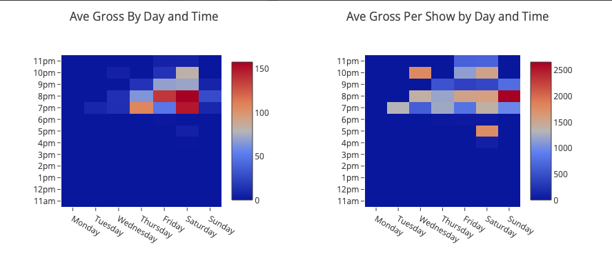

# Revenue Wizard - Theater Financial Reconciliation & Analytics Platform

A comprehensive financial management system that automates shows reconciliations (payouts) and provides business intelligence analytics for theater operations.




## Overview

The Revenue Wizard transformed PianoFight's financial operations by automating the complex process of show reconciliation (calculating payouts to producers) and providing deep analytics into business performance. What previously took hours per show now takes minutes, with work distributed from the financial director to show bookers.

## Business Impact

### Reconciliation Automation
-  **90% time savings** - Reconciliation time reduced from 30+ minutes to 3 minutes per show
-  **Distributed workload** - Shifted from financial director bottleneck to booker self-service
-  **Improved accuracy** - Eliminated manual calculation errors
-  **Better record keeping** - All deal terms saved and retrievable

### Business Analytics
-  **Revenue optimization** - Identified most profitable deal structures
-  **Performance tracking** - Real-time visibility into theater performance
-  **Strategic insights** - Data-driven programming decisions
-  **Behavioral analysis** - Understanding audience buying patterns

## Core Features

### 1. Automated Financial Reconciliation

**The Problem:**
Theater shows have complex revenue splits involving:
- Ticket sales (online vs door)
- Multiple fee structures (Eventbrite fees, payment processing, PianoFight margin)
- Variable deal terms (rental, co-production, internal, etc.)
- Deposits, technician fees, miscellaneous expenses
- Profit sharing percentages

Manual calculation was time-consuming, error-prone, and created bottlenecks.

**The Solution:**
Automated reconciliation that:
- Pulls real-time ticket sales data from Eventbrite API
- Applies saved contractual deal terms
- Calculates exact payout amounts
- Generates professional reconciliation reports
- Exports to CSV for accounting

**Key Calculations:**
```javascript
// True revenue breakdown by source
True Rental Revenue = Base rent - Deposits
True Tech Revenue = Technician fees
True Ticket Revenue = PF royalty + licensee fees
True Split Revenue = (Gross - Expenses) × PF profit share %
True Total Revenue = Sum of all revenue streams
```

### 2. Deal Term Management

Save and retrieve contractual terms per show:
- Rental fees and deposits
- Technician charges
- Miscellaneous expenses (with notes)
- PF profit share percentage
- Deal type classification
- Venue/stage assignment

**Data Persistence:**
- Stored in JSON database via PHP backend
- Searchable and filterable by any term
- Historical tracking with timestamps
- Highlighted when terms are pre-saved

### 3. Business Intelligence Analytics

**Revenue Analysis:**
- Revenue breakdown by type (rental, tech, tickets, splits)
- Revenue by deal type (rental, copro, internal, school, etc.)
- Number of shows by deal type
- Top shows by average revenue
- Top shows by number of performances

**Temporal Analysis:**
- Daily/weekly/monthly revenue trends
- Revenue by day of week
- Average revenue by day and time (heatmap)
- Average revenue per show by day and time
- Identify optimal programming windows

**Deal Performance:**
- Compare profitability across deal structures
- Internal vs external production analysis
- Split revenue breakdown by category
- Accounts receivable tracking

### 4. Flexible Reporting

**Date Range Filtering:**
- Last 1/7/30/90 days
- Custom date ranges
- All-time historical view

**Show Filtering:**
- All shows aggregate view
- Individual show deep-dive
- By deal type
- By venue/stage
- Include/exclude zero-revenue events

**Export Options:**
- CSV export for Excel/accounting software
- Professional reconciliation PDFs
- Analytics snapshots

## Technical Architecture

### Frontend
- **Pure JavaScript** - No framework dependencies
- **jQuery** - DOM manipulation and AJAX
- **Plotly.js** - Interactive visualizations
- **Chosen.js** - Enhanced select dropdowns

### Backend
- **PHP** - Server-side processing
- **MySQL** - Financial data storage (optional)
- **JSON** - Deal terms database

### Data Sources
- **Eventbrite API** - Live ticket sales data
- **Custom reconciliation database** - Saved deal terms
- **Cache busting** - Ensures fresh data on every load

### Key Technologies
- **AJAX** - Asynchronous data updates
- **Event-driven architecture** - Responsive UI updates
- **Data visualization** - Multiple chart types
- **CSV generation** - Client-side export

## How It Works

### Reconciliation Workflow

1. **Load Event Data**
   ```javascript
   // Fetch all event, attendee, and venue data
   xmlHttp.open("GET", "events-all.JSON?v=" + randomVar)
   myEvents = JSON.parse(xmlHttp.responseText)
   ```

2. **Calculate Revenue**
   ```javascript
   // Process each attendee transaction
   totalRev += attendee.costs.gross.value/100
   totalEBFees += attendee.costs.eventbrite_fee.value/100
   pfRoyalty = totalRev - listedPrice - totalEBFees - totalPaymentFees
   ```

3. **Apply Deal Terms**
   ```javascript
   // Retrieve saved reconciliation variables
   trueRentalRev = myReconStats[eventId].rentFee
   trueSplitRev = (revenue - expenses) * (profitShare/100)
   ```

4. **Generate Report**
   - Display breakdown on screen
   - Enable CSV export
   - Create PDF reconciliation

### Analytics Pipeline

1. **Aggregate Data** - Sum revenues by various dimensions
2. **Calculate Metrics** - Averages, totals, percentages
3. **Visualize** - Render interactive charts
4. **Filter** - Allow dynamic exploration

## Revenue Breakdown Example

```
Show: "Comedy Night"
Date: Friday, October 13, 2023 8:00 PM

Online Sales: $850 (45 tickets)
Door Sales: $180 (9 tickets)
Total Gross: $1,030

Eventbrite Fees: ($85.30)
Payment Processing: ($31.20)
PF Ticket Margin: $116.50

Rental Fee: $350
Deposit: ($100) [returned]
Technician: $50
PF Profit Share (70%): $240.80

True Total PF Revenue: $657.30
Producer Payout: $102.80
```

## Analytics Insights

### Most Profitable Time Slots
Heatmap analysis revealed:
- **Friday 8PM**: Highest average revenue ($650)
- **Saturday 10PM**: Best for late-night comedy ($580)
- **Sunday 7PM**: Underutilized, opportunity for growth

### Deal Type Performance
- **Co-productions**: Highest total revenue contributor
- **Rentals**: Most consistent, lowest risk
- **Internal shows**: Best for brand building, moderate revenue

### Seasonal Patterns
- Holiday months (Nov-Dec): 40% revenue increase
- Summer (Jun-Aug): 25% revenue decrease
- Tax season (Apr): Lowest attendance

## Security & Privacy

- Database credentials removed from public repository
- No personally identifiable customer information exposed
- Financial data aggregated for analytics
- Role-based access control in production

## Setup Requirements

1. **Eventbrite Integration**
   - Organization access to Eventbrite API
   - Scheduled jobs to fetch updated data

2. **PHP Server**
   - PHP 7.0+ with MySQL support
   - Write permissions for JSON database

3. **Database** (optional)
   - MySQL for persistent storage
   - Alternative: JSON file-based storage

4. **Configuration**
   - Set database credentials (not in repo)
   - Configure Eventbrite API endpoints
   - Adjust fee calculations for your business model

## Files

- `index-sf.html` - Main application interface
- `reconStats.php` - Save/retrieve deal terms
- `sqlRequest.php` - Database queries (credentials removed)
- Sample JSON data files would go in `/internal/` directory

## Future Enhancements

- [ ] Machine learning for revenue prediction
- [ ] Automated anomaly detection (missing reports, unusual figures)
- [ ] Mobile-responsive design
- [ ] Real-time dashboard for management
- [ ] Integration with accounting software (QuickBooks, Xero)
- [ ] Producer portal for self-service reconciliation
- [ ] Email notifications for completed reconciliations
- [ ] Multi-venue support
- [ ] A/B testing framework for pricing strategies

## Lessons Learned

- **Automation multiplies value** - 90% time savings across many shows = massive impact
- **Distributed work is better** - Empowering bookers reduced bottlenecks
- **Data reveals hidden truths** - Analytics showed counterintuitive insights
- **Simple interfaces win** - Despite complexity, the UI stayed straightforward
- **Historical data is gold** - Years of saved reconciliations enabled trend analysis

## Business Value Proposition

**For Financial Teams:**
- Eliminate manual calculation errors
- Reduce reconciliation time by 90%
- Better audit trail and record keeping
- Instant access to historical deal terms

**For Management:**
- Real-time visibility into venue performance
- Data-driven programming decisions
- Identify underperforming time slots
- Optimize deal structures for profitability

**For Producers:**
- Faster payment processing
- Transparent calculations
- Historical performance data
- Self-service reconciliation

## Case Studies

_(See additional documentation in /case-studies/ folder)_

1. **Optimizing Friday Night Programming** - Used heatmap data to identify 8PM as peak revenue time
2. **Co-Production vs Rental Analysis** - Determined optimal mix of deal types
3. **Seasonal Programming Strategy** - Adjusted calendar based on historical patterns

---

*This project demonstrates full-stack development, financial domain expertise, business intelligence, automation, and measurable business impact.*
